# Evaluation

## Overview

- **Template Integration**: 
  - Firstly, templates are added for the model inference results to generate JSONL files for each model.

- **Solution Submission**:
  - Processed solutions are then submitted to the database, with the default result set to 14.

- **Batch Judging**:
  - To initiate batch judging, the results are manually set to 0. 
  - Subsequently, the "judged" process is launched for evaluation.

- **Result Viewing**:
  - A solution result less than 4 indicates ongoing judging, while a result greater than or equal to 4 and not equal to 14 indicates completed judging.

- **Performance Measurement**:
  - Measures the performance of the code polishing problem source code on the machine.
  - Updates the time and memory limits in the database.
  
- **Calculate Metrics**:
  - Finally calculate the metrics for the four scenarios.

## Solution's Result Display
- Here is an explanation of the different results of a solution:
  - OJ_WT0 (0): Submission queued for judging.
  - OJ_WT1 (1): Retest queued for judging.
  - OJ_CI (2): Compiling (task has been dispatched).
  - OJ_RI (3): Running.
  - OJ_AC (4): Answer is correct.
  - OJ_PE (5): Presentation Error (formatting issue).
  - OJ_WA (6): Wrong Answer.
  - OJ_TL (7): Time Limit Exceeded.
  - OJ_ML (8): Memory Limit Exceeded.
  - OJ_OL (9): Output Limit Exceeded.
  - OJ_RE (10): Runtime Error.
  - OJ_CE (11): Compilation Error.
  - OJ_CO (12): Compilation Completed.
  - OJ_TR (13): Test Run Ended.
  - OJ_MC (14): Awaiting manual confirmation.
  
## Database Architecture

To access the database, follow these steps:
```bash
cd /home/judge/scripts
bash mysql.sh
```
Based on the database schema, design SQL queries for querying.


## Install

1. Download the Docker image:
    ```bash
    docker pull xliudg/code_editor_bench:latest
    ```
2. Create and enter the container:
    ```bash
    docker run -d \
        -v /path/to/your/downloaded/git/evaluation/judge:/home/judge \
        --name judge code_editor_bench
    docker exec -it judge /bin/bash
    ```

## Perform Evaluation

Please evaluate the code in the container.

1. Add a template for codes. Store codes generated by LLMs in the following format:

    ```
    solution_root
    │
    ├── code_debug
    │   ├── model_name1.jsonl
    │   ├── model_name2.jsonl
    │   └── ...
    │
    ├── code_polishment
    │   ├── model_name1.jsonl
    │   ├── model_name2.jsonl
    │   └── ...
    │
    ├── code_switch
    │   ├── model_name1.jsonl
    │   ├── model_name2.jsonl
    │   └── ...
    │
    └── code_translate
        ├── model_name1.jsonl
        ├── model_name2.jsonl
        └── ...
    ```

    Each line of each solution jsonl file should contain the following fields:

    ```
    { 
      "problem_id": Integer representing the problem,
      "completion_id": Integer representing the index of the solution generated by a specific model of the problem, starting from 0,
      "language": Language of the code,
      "code": Code content of the solution
    }
    ```

    Execute:
    ```bash
    cd /home/judge/scripts
    python3 add_template.py
    ```

    Output is located at: `/home/judge/solution_folder/processed_solution`

2. Submit the model's solutions to the database:
    ```bash
    python3 submit_solution.py
    ```

3. Start judging:
   
    Run inside the Docker container:
    ```bash
    nohup bash run_judge.sh > runlog.out 2>&1 &
    ```

    Enter the MySQL database inside Docker:
    ```bash
    bash mysql.sh
    ```

    Query the models whose solutions have been submitted:
    ```sql
    select model_id,model_name from models where model_id>48;
    ```

    Set the result of the solutions associated with a specific model to be judged:
    - Using model_name:
        ```sql
        UPDATE solution so
        join (
        select s.solution_id,s.result
        from solution s
        join models m on s.model_id=m.model_id
        where model_name='your_model_name_here'
        ) AS subquery ON so.solution_id = subquery.solution_id
        SET so.result = 0;
        ```
    - Using model_id:
        ```sql
        UPDATE solution so
        join (
        select s.solution_id,s.result
        from solution s
        join models m on s.model_id=m.model_id
        where model_id='your_model_id_here'
        ) AS subquery ON so.solution_id = subquery.solution_id
        SET so.result = 0;
        ```

4. Enter the MySQL database inside Docker and check judging status:
   
    Query the count of unsolved solutions. If the count is 0, judging is complete:

    - View all unsolved solutions:
        ```sql
        SELECT COUNT(*)
        FROM solution s
        JOIN problem p ON s.problem_id = p.problem_id
        WHERE s.result < 4 OR s.result = 14;
        ```

    - View unsolved solutions for a specific model:
        ```sql
        SELECT COUNT(*)
        FROM solution s
        JOIN problem p ON s.problem_id = p.problem_id
        WHERE s.model_id = 'your_model_id_here' AND (s.result < 4 OR s.result = 14);
        ```

5. Measure the performance of source code for Code Polish problems on the machine:
    ```bash
    python3 measure_polish_source_code.py
    ```

    After executing the above command, update the time and memory limit for Code Polish problems in the database:
    ```bash
    python3 update_polish_lmt.py
    ```

6. Compute metrics:
    ```bash
    python3 compute_metrics.py
    ```
